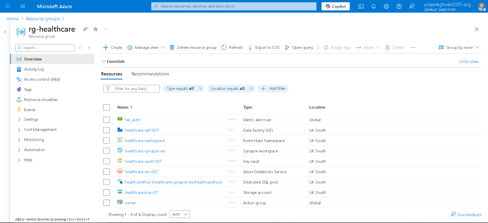

# Real-Time Patient Flow Analytics on Azure


---

## 📑 Table of Contents
- [📌 Project Overview](#-project-overview)
- [🎯 Objectives](#-objectives)
- [📂 Project Structure](#-project-structure)
- [🛠️ Tools & Technologies](#️-tools--technologies)
- [📐 Data Architecture](#-data-architecture)
- [⭐ Star Schema Design](#-star-schema-design)
- [⚙️ Step-by-Step Implementation](#️-step-by-step-implementation)
  - [1. Event Hub Setup](#1-event-hub-setup)
  - [2. Data Simulation](#2-data-simulation)
  - [3. Storage Setup](#3-storage-setup)
  - [4. Databricks Processing](#4-databricks-processing)
  - [5. Synapse SQL Pool](#5-synapse-sql-pool)
  - [6. Version Control](#6-version-control)
- [📊 Data Analytics](#-data-analytics)
- [✅ Key Outcomes](#-key-outcomes)
- [📜 License](#-license)

---

## 📌 Project Overview
This project demonstrates a **real-time data engineering pipeline** for healthcare, designed to analyze **patient flow across hospital departments** using Azure cloud services.  
The pipeline ingests streaming data, processes it in **Databricks (PySpark)**, and stores it in **Azure Synapse SQL Pool** for analytics and finally visualisation in Power BI and design an interactive dashboard for hospital KPIs.

## Pipeline


## All resources in resource grp

---

## 🎯 Objectives
- Collect real-time patient data via **Azure Event Hub**.
- Process and cleanse data using **Databricks** (Bronze → Silver → Gold layers).
- Implement a **star schema** in **Synapse SQL Pool** for efficient querying.
- Enable **Version Control** with Git.

---

## 📂 Project Structure
```
ETL-PROJ-AZURE-DATABRICKS_04/
    ├── client_requirements/
    │   └── client_requirements_de.pdf       # Demo Client Requirement
    ├── databricks-notebooks/
    │   ├── 01-bronzerawdata.ipynb           # Data Ingestion & Raw Layer (Bronze) Notebook
    │   ├── 02-silver-cleandata.ipynb        # Data Cleaning & Conformed Layer (Silver) Notebook
    │   └── 03-gold-transform.ipynb          # Data Transformation & Aggregate Layer (Gold) Notebook
    ├── powerbi/
    │   └── Healthcare_Visualisation-Dashboard.pbix # Power BI Dashboard file
    ├── simulator/
    │   └── patient_flow_generator.py        # Python script for generating simulated data
    ├── snaps/                               # Directory for screenshots or reference images
    │   └── rg-snap.PNG                      # Snapshot of a Resource Group or similar
    ├── sqlpool-queries/                     # Dedicated SQL scripts for the data warehouse (Synapse SQL Pool)
    │   ├── Final Business Views.sql         # Final SQL views for reporting/consumption
    │   ├── Pre-Requisites.sql               # SQL scripts for setting up necessary objects
    │   └── Tables.sql                       # SQL scripts for table creation/DDL
    ├── .gitignore                           # Git ignore fileinformation/notes
    └── README.md                            # Main project documentation (where this structure goes)

```

---

## 🛠️ Tools & Technologies
- **Azure Event Hub** – Real-time data ingestion
- **Azure Databricks** – PySpark-based ETL processing
- **Azure Data Lake Storage** – Staging raw and curated data
- **Azure Synapse SQL Pool** – Data warehouse for analytics
- **Power BI** – Dashboarding (future step)
- **Python 3.9+** – Core programming
- **Git** – Version control

---

## 📐 Data Architecture
The pipeline follows a **multi-layered architecture**:
- **Bronze Layer**: Raw JSON data from Event Hub stored in ADLS.
- **Silver Layer**: Cleaned and structured data (validated types, null handling).
- **Gold Layer**: Aggregated and transformed data ready for BI consumption.

---

## ⭐ Star Schema Design
The **Gold layer** data in Synapse follows a **star schema** for optimized analytics:
- **Fact Table**: `FactPatientFlow` (patient visits, timestamps, wait times, discharge)
- **Dimension Tables**:
  - `DimDepartment` – Department details
  - `DimPatient` – Patient demographic info
  - `DimTime` – Date and time dimension

---

## ⚙️ Step-by-Step Implementation

### **1. Event Hub Setup**
- Created **Event Hub namespace** and **patient-flow hub**.
- Configured **consumer groups** for Databricks streaming.

---

### **2. Data Simulation**
- Developed **Python script** `patient_flow_generator.py` to stream fake patient data (departments, wait time, discharge status) to Event Hub.
- [Producer Code](simulator/patient_flow_generator.py)

---

### **3. Storage Setup**
- Configured **Azure Data Lake Storage (ADLS Gen2)**.
- Created containers for **bronze**, **silver**, and **gold** layers.

---

### **4. Databricks Processing**
- [**Notebook 1**](databricks-notebooks/01_bronze_rawdata.py): Reads Event Hub stream into Bronze.
- [**Notebook 2**](databricks-notebooks/02_silver_cleandata.py): Cleans and validates schema.
- [**Notebook 3** ](databricks-notebooks/03_gold_transform.py): Aggregates and prepares star schema tables.

---

### **5. Synapse SQL Pool**
- Created **dedicated SQL Pool**.
- Executed schema and fact/dimension creation queries from

---

### **6. Version Control**
- Version control with **Git**

<br />
<br />

## 📊 Data Analytics

Once the **data pipeline** was established and a **Star Schema** implemented in Synapse SQL Pool, the next step was to build an **interactive dashboard in Power BI**.  

### **🔗 Synapse → Power BI Connection**
- Connected **Azure Synapse SQL Pool** to Power BI using a direct SQL connection.  
- Imported **FactPatientFlow** and **Dimension tables**.  
- Established relationships for **Star Schema-based reporting**.  

<br />

## ✅ Key Outcomes
- **End-to-End Pipeline:** From **real-time ingestion → transformation → warehouse → analytics**.  
- **Scalable Architecture:** Easily adaptable for different hospital datasets.  
- **Business Insights:** Hospital admins can monitor **bed usage, patient flow, and department efficiency** in real time.  
- **Portfolio Value:** Demonstrates both **Data Engineering** and **Analytics skills** in one project.  

